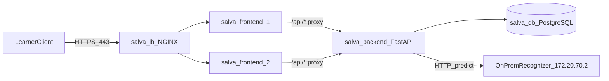

# ASL Academy

Gamified American Sign Language fingerspelling app with structured lessons, camera-based sign practice, challenges, XP progression, Stripe subscriptions, and an admin dashboard.

## Documentation

This GitHub repository contains all project documentation and information for ASL Academy.

**Production app:** https://10.49.12.41

| Document | Contents |
| --- | --- |
| This README | Architecture, network, security, production deployment |
| [frontend/README.md](frontend/README.md) | Expo client, code structure, build and deploy |
| [backend/README.md](backend/README.md) | FastAPI, application layers, sign recognition |
| [backend/DATABASE.md](backend/DATABASE.md) | Relational model, 3NF design, Alembic migrations |
| [frontend/Credits.md](frontend/Credits.md) | Third-party visual asset attributions |

**Local development:** start with [backend/README.md](backend/README.md), then [frontend/README.md](frontend/README.md).

## Features

- **Curriculum path** — Units, lessons, and exercises served by the API (`GET /api/v1/curriculum/units`, `GET /api/v1/lessons/{id}`)
- **Multiple-choice and camera practice** — Quiz exercises and live camera capture via `expo-camera`
- **Sign recognition** — Camera frames sent to `POST /api/v1/signs/recognize`; backend delegates to an on-prem ML service
- **Gamification** — XP, levels, streaks, practice heatmap, and weekly challenges
- **Authentication** — JWT register/login (`POST /api/v1/auth/register`, `POST /api/v1/auth/login`)
- **Subscriptions** — Stripe checkout and webhook handling (`/api/v1/billing/*`)
- **Admin** — Curriculum management and usage metrics (`/api/v1/admin/*`)

## Architecture

Production runs on a private OpenStack network with tiered services behind an NGINX load balancer.



### Request flow

1. The learner opens `https://10.49.12.41` (HTTPS terminates at the load balancer).
2. NGINX distributes static traffic across two frontend replicas.
3. Each frontend serves a static Expo web export and proxies `/api/` to the backend.
4. The backend reads and writes curriculum, progress, and billing data in PostgreSQL.
5. For camera exercises, the backend forwards frames to the on-prem recognizer when `RECOGNIZER_IMPL=asl_rec`.

## Infrastructure and network

| Role | Host | IP | Service |
| --- | --- | --- | --- |
| Load balancer | `salva-lb` | `172.20.70.149` | NGINX :443 |
| Frontend 1 | `salva-frontend-1` | `172.20.70.165` | Static web :80 |
| Frontend 2 | `salva-frontend-2` | `172.20.70.166` | Static web :80 |
| Backend API | `salva-backend` | `172.20.70.140` | Uvicorn :8000 |
| Database | `salva-db` | `172.20.70.144` | PostgreSQL :5432 |
| On-prem ML | NixOS host | `172.20.70.2` | Docker/Flask :5000 |

**Cloud:** OpenStack, availability zone `nova`, private subnet `172.20.70.0/24`.

**Public access:** `https://10.49.12.41` — a Cisco router NAT rule forwards WAN port 443 to the load balancer (`10.49.12.41:443 → 172.20.70.149:443`). HTTP is not forwarded; the site is HTTPS-only.

**Client network:** Learners and operators on the course Nube VLAN (`192.168.200.0/24`) reach the private infra subnet through an inter-VLAN gateway at `172.20.70.10`.

**SSH access:** Instances are reachable over SSH from the course client network when routed to `172.20.70.0/24`. Use the team key pair issued for this project:

```bash
ssh -i equipo-salva debian@172.20.70.140
```

## Security posture

### Network segmentation

OpenStack security groups enforce tiered exposure. The load balancer is the public choke point; backend port 8000 is reachable only from the frontend tier; PostgreSQL port 5432 is reachable only from the backend.

| Security group | Ingress | Source | Egress |
| --- | --- | --- | --- |
| `sg-edge` (LB) | TCP 443 | Approved client CIDRs | TCP 80 to frontends |
| `sg-frontend` | TCP 80 | `sg-edge` | Established traffic |
| `sg-backend` | TCP 8000 | `sg-frontend` | TCP 5432 to DB; inference port to `172.20.70.2/32` |
| `sg-database` | TCP 5432 | `sg-backend` | Established traffic |

### Load balancer hardening

`salva-lb` runs NGINX with request-rate and connection limits:

- `limit_req_zone` at 10 requests/s per client IP (burst 20)
- `limit_conn` at 20 concurrent connections per client IP
- Client/header/send timeouts and `reset_timedout_connection`
- Kernel SYN-cookie protection enabled (`tcp_syncookies = 1`)

### Application controls

- Passwords hashed with bcrypt (Passlib)
- JWT access tokens with expiration
- Backend secrets in `/etc/asl-backend.env` (root-owned, mode 600)
- Uvicorn runs as non-root user `debian` under systemd

### Known limitations

- No application-level rate limiting on FastAPI yet (LB is the first line of defense)
- JWT logout is stateless and does not revoke issued tokens
- Single instances for backend, database, and load balancer (see Reliability)

## Reliability

- **Frontend tier:** Two NGINX replicas behind the load balancer provide horizontal redundancy for static content.
- **Backend:** Single Uvicorn process with `Restart=always` under systemd.
- **Database:** Single PostgreSQL 15 instance on a dedicated host.
- **Load balancer:** Single NGINX ingress node.

If a frontend replica is stale or unreachable, drain it on `salva-lb` (`172.20.70.149`) by marking its upstream `down` in `/etc/nginx/sites-enabled/*`, running `sudo nginx -t`, and reloading NGINX.

## Quick start (local)

1. Start the [backend](backend/README.md) (FastAPI on port 8000).
2. Start the [frontend](frontend/README.md) (Expo dev server).

## Production deployment

Production hosts keep a checkout of this repo at `/opt/asl`. Update the existing checkout in place; do not reclone for normal deploys.

**Deploy order:** backend → frontends (one node at a time) → verify load balancer upstreams.

See [backend/README.md](backend/README.md) and [frontend/README.md](frontend/README.md) for package-specific setup details.

### Backend rollout (`salva-backend`, `172.20.70.140`)

```bash
ssh -i equipo-salva debian@172.20.70.140 '
  set -e
  cd /opt/asl
  git fetch origin
  git reset --hard origin/main
  cd /opt/asl/backend
  .venv-prod/bin/pip install .
  .venv-prod/bin/alembic upgrade head
  .venv-prod/bin/python -m scripts.seed_curriculum
  sudo systemctl restart asl-backend
'
```

Verify:

```bash
ssh -i equipo-salva debian@172.20.70.140 '
  systemctl status --no-pager --lines=8 asl-backend.service
  curl -sS http://127.0.0.1:8000/health
  curl -sS http://127.0.0.1:8000/api/v1/billing/plans
'
```

### Frontend rollout (`salva-frontend-1` / `salva-frontend-2`)

Deploy one node at a time (`172.20.70.165`, `172.20.70.166`):

```bash
ssh -i equipo-salva debian@172.20.70.166 '
  set -e
  cd /opt/asl
  git fetch origin
  git reset --hard origin/main
  cd /opt/asl/frontend
  pnpm install --frozen-lockfile
  EXPO_PUBLIC_API_URL=/api/v1 pnpm exec expo export --platform web
  sudo mkdir -p /var/www/asl
  sudo cp -a dist/. /var/www/asl/
  sudo systemctl reload nginx
'
```

`rsync` is not installed on the frontend hosts; publish with `sudo cp -a` unless you install `rsync` first.

Verify:

```bash
ssh -i equipo-salva debian@172.20.70.166 '
  curl -I http://127.0.0.1/healthz
  curl -I http://127.0.0.1/
  curl -sS http://127.0.0.1/api/v1/billing/plans
'
```

### Deployment notes

- If a host checkout is dirty, inspect `git status` before resetting. Deploy checkouts are expected to track `origin/main`.
- Roll the backend before frontends so API changes are live before a new static bundle ships.
