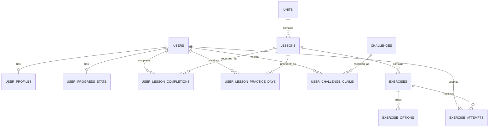

# Database design

This document describes the schema introduced by Alembic revision
`4e55865df366`. PostgreSQL is the production database; SQLite remains supported
for local tests.

## Design goals

- Preserve the existing API contract.
- Keep curriculum identifiers stable across deployments and frontend links.
- Store user actions as normalized, auditable facts.
- Make repeated completion and challenge-claim requests idempotent.
- Derive totals from their source facts instead of synchronizing JSON arrays
  and counters.
- Enforce ordering, uniqueness, value ranges, and relationships in the
  database.
- Index the actual read and write patterns used by the application.

## Entity model



### Identity and reference data

| Table | Primary key | Rationale |
| --- | --- | --- |
| `users` | UUID | User identity is generated independently of personal data. |
| `user_profiles` | `user_id` | A profile is a one-to-one extension of a user. |
| `units` | stable string code | Codes such as `unit-1` are version-controlled API identifiers. |
| `lessons` | stable string code | Lesson codes are used by routes and frontend navigation. |
| `exercises` | stable string code | Exercise codes are sent by lesson and recognition requests. |
| `exercise_options` | `(exercise_id, value)` | Options have no identity outside their parent exercise. |
| `challenges` | stable string code | Challenge codes are version-controlled and API-visible. |

Using UUIDs for every curriculum row would add storage and index cost without
improving identity semantics. The stable codes are natural keys in this domain.

### User facts

| Table | Primary key | Meaning |
| --- | --- | --- |
| `user_progress_state` | `user_id` | Mutable state that cannot be reconstructed: currently hearts. |
| `user_lesson_completions` | `(user_id, lesson_id)` | One idempotent completion fact per user and lesson. |
| `user_lesson_practice_days` | `(user_id, lesson_id, practiced_on)` | At most one practice fact per lesson and day. |
| `user_challenge_claims` | `(user_id, challenge_id)` | One idempotent reward claim per user and challenge. |
| `exercise_attempts` | generated bigint | Append-only quiz and camera attempt history. Camera skips are stored as correct camera attempts with `skipped = true`. |

The completion and claim rows store the XP awarded at that moment. This keeps
historical totals stable if the reward configured for future users changes.
Daily practice boundaries currently use UTC consistently across writes and
streak calculations.

## Derived progress

The application derives the following values from normalized facts:

| Value | Source |
| --- | --- |
| Completed lesson IDs | `user_lesson_completions` |
| Lesson XP | Sum of completion `xp_earned` |
| Claimed challenge IDs | `user_challenge_claims` |
| Challenge XP | Sum of claim `xp_earned` |
| Practice days and streak | Distinct dates in `user_lesson_practice_days` |
| Lessons completed today | Distinct lessons practiced today |
| Successful camera passes | Correct camera attempts where `skipped = false` |
| Letters learned | Distinct one-character letter exercises passed by camera where `skipped = false` |

These values are not stored twice. This removes the consistency failures that
were possible when lists were serialized into `user_progress` text columns.

## Access patterns and indexes

| Access pattern | Supporting key or index |
| --- | --- |
| Login by normalized email | Unique index on `users.email` |
| Lessons in unit order | Unique `(unit_id, sort_order)` |
| Exercises in lesson order | Unique `(lesson_id, sort_order)` |
| Options in exercise order | Unique `(exercise_id, sort_order)` |
| User completions in time order | `(user_id, completed_at)` |
| Completion counts for a lesson | `user_lesson_completions(lesson_id)` |
| Daily practice and streak queries | `(user_id, practiced_on)` |
| Practice counts for a lesson | `user_lesson_practice_days(lesson_id)` |
| User claims in time order | `(user_id, claimed_at)` |
| User attempt history | `(user_id, attempted_at)` |
| Camera success aggregation | `(user_id, attempt_type, is_correct, exercise_id)` |
| Exercise correctness analytics | `(exercise_id, is_correct)` |

Unique ordering constraints already create indexes, so duplicate non-unique
indexes on the same columns are intentionally omitted.

## Integrity and concurrency

- Emails are stored lowercase and protected by a unique constraint.
- Registration uses `ON CONFLICT DO NOTHING`, so concurrent requests for the
  same email resolve as a conflict rather than creating duplicates.
- Completion and claim composite primary keys are the idempotency mechanism.
- Completion and claim inserts also use `ON CONFLICT DO NOTHING`.
- Daily practice uses `(user_id, lesson_id, practiced_on)`, so request retries
  do not inflate the daily count while the same lesson can be practiced again
  on a later date.
- Heart decrement is one atomic SQL update and cannot produce a negative value.
- Foreign keys cascade user-owned data when a user is deleted.
- Historical facts restrict deletion of referenced lessons, exercises, and
  challenges.
- Check constraints validate exercise types, content types, challenge
  categories, non-negative rewards, ordering, and confidence range.
- A partial unique index allows at most one correct answer option per exercise.
- Application services validate that quiz attempts target quiz exercises and
  camera attempts target camera exercises before inserting attempt facts.
- Camera skips use `POST /lessons/{lesson_id}/exercises/{exercise_id}/skip` and
  record a correct camera attempt with `skipped = true`, which advances lesson
  flow without counting toward camera mastery challenges.

All related writes execute inside the request Unit of Work and commit or roll
back together.

## Why the broader proposal was reduced

The proposed route/module/question/trophy model is reasonable for a larger
learning-management platform, but those abstractions do not exist in the
current application:

- A unit is already the learning route and a lesson is already the module.
- Each current exercise contains one atomic interaction, so a separate
  questions table would add joins without representing additional behavior.
- Trophy behavior is not implemented; challenges are the current reward model.
- Generic XP transactions with polymorphic `source_id` cannot enforce a foreign
  key to their source. Explicit completion and claim facts provide stronger
  integrity for the two real XP sources.
- Separate route, module, and exercise progress rows would duplicate values
  that can be derived from completion and attempt facts.

The schema can add those concepts later when the product introduces the access
patterns and invariants that require them.

## Schema lifecycle

The application does not create tables during startup. Deployment applies the
schema explicitly:

```bash
alembic upgrade head
python -m scripts.seed_curriculum
```

The seed command upserts version-controlled curriculum, options, and challenge
definitions and is safe to run repeatedly.

Revision `4e55865df366` is a baseline for an empty database. It does not attempt
to transform the legacy schema containing serialized progress columns. The
planned deployment must back up any data that needs to be retained, recreate
the database, apply the revision, and then seed reference data.
